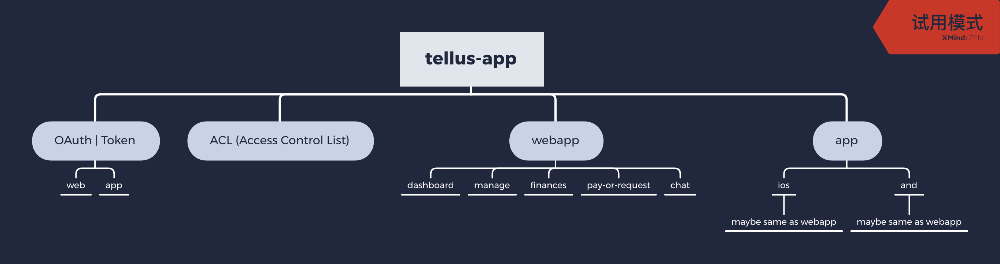

# webapp问题整理：

1. API不清楚，API缺少文档，不清楚每个API的作用，需要一份完整的API文档。
2. 路由权限逻辑不清楚，路由嵌套规则不清楚。有太多的重定向路由了，哪些路由需要权限？权限是如何控制的？
3. 公用API和公用状态都有哪些？是否可以提取出来然后拆分后做注入？
4. 哪一些路由是需要权限的？无权限时是如何做重定向的？有哪些页面有重定向？如何做错误处理的？
5.  如下代码 ：
```  const homeRoute = !isTenant ? '/account/home' : '/account/payments';``` 
这段代码是根据用户角色权限来做重定向的吗？`processNewUserAndRedirect`这个方法看起来像检测用户信息的？在某些情况下会重定向到`/session/role-switcher`， 但是`/session/role-switcher`这个路径对应的组件我没有在页面上找到。

	```{onBasePath && isEmpty(currentUser) && !isBranchLink && <Redirect to="/session/auth/sign-in" />}``` 
	
	这段代码看起来好像是做权限验证的，但是不明白isBranchLink的作用，开起来像是根据查询字符串来验证是否登陆？登陆的业务逻辑不清楚。。。
	
6. 太多类似的代码了，如果要拆分应用，那我必须要清楚所有重定向的地方，需要把类似```this.history.push ``` 或者 ```<Redirect to="/">``` 类似的代码替换成```window.location.href``` 或者 ```<a href="//:">```
7. 全局状态都存放在哪里？是否有做统一管理？各个页面中的reducer是否有相互依赖？每个页面是独立的状态还是有共享状态？
8. 我们需要清楚页面基本的跳转逻辑以及权限控制，有太多的方法没有注释，需要逐行查找才能明白，这样很浪费时间，最好能够直接与当时的项目参与者沟通。

9. 项目内的UI组件d似乎没有文档，我找到了 <strong>stories</strong>文件夹，但是我只看到了两个组件的说明文档，能否提供更详细的使用文档？

## 方案
总体问题：
1. 业务逻辑不熟悉，需要花时间，但没有prd，flowchat等doc    
2. 代码不熟悉，页面及组件依赖关系需要花时间  
3. API data-format也需要学习熟悉
4. 需要整理buglist  
7月18日晚上和7月19日早上，Paul找到的都是Eric已经记录，但是是否修复，需要在production再进行验证。另外，最好能有QA记录的buglist，更为全面。  
`预计需要一天时间和Cecilia翻译的帮助`

对于目前的迭代任务有三种方式  
A. 一部分人修复bug，一部分人开发新版
> 问题  
* 需要拆分出给开发使用的代码，比较费时间

> 方案  
* 延长开发

> 时间  
* 没做过，无法估计

B. 拆分现有web-app，物理上隔离，进行交叉替换上线
> 问题  
* 各个文件路由耦合在一起，多级路由强依赖共享状态
* reducer耦合，redux只支持单一Store，拆分路由在当前模式下会导致状态无法共享
* 拆分后需要nginx重新配置config，今后上线也可能需要2个步骤
* 不确定拆分后是否存在隐藏bug，需要QA完整回归，有可能带来更多bug
这些原因会导致工期很长，且时间无法确定

> 方案
请Laurie帮助，解释整体路由跳转的逻辑和流程。
* 路由整理或部分重构
* reducer耦合，部分非重要信息放在storage
* 保留一个nginx.conf 每次上线，shell脚本进行替换
* 无法确定拆分后是否存在隐藏bug

> 预计时间  
* 先讨论后确认

C. 直接开始新版，完成一部分替换一部分
> 问题
* 是否采取PC和Mobile两套设计稿或方案，而不是responsive？
* onboard所需的组件，还有4个尚未开发或开发完毕的
* 数据交互

> 方案
* 分批次，先做可以做的，没有的定义好规范，先import上需要的组件，即便是空功能；业务和组件共同开发
* 查看过去的注册模块

> 预计时间  
* 每次迭代确认，因为没有文档，每次开发都需要很多时间研究过去代码

## 理想架构
各个spa首先获取Token，再根据Token获取ACL(Access Control List)，每个项目，例如（account的用户权限，功能列表，操作的信息最好是sessionstorage或临时获取）



## 讨论和结果
> T 确认采取C方案，需要Paul研究实际拆分方案，从“onboarding”开始。Laurie说了一堆他的想法，但没实际作用；向其它部门咨询了具体的API调用和实际流程。应该还是FE自己研究和开发

