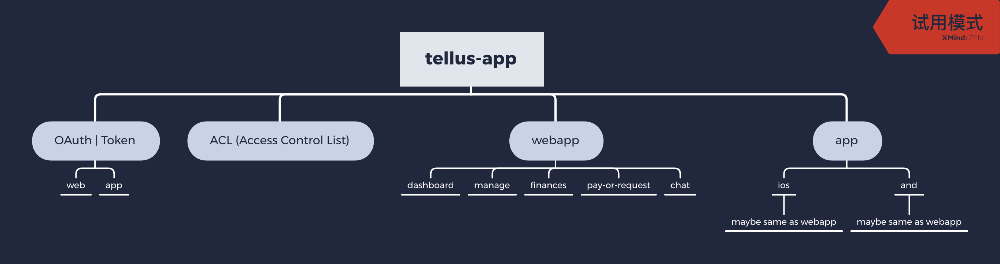

## tellus-webapp 迭代技术方案
总体问题：
1. 业务逻辑不熟悉，需要花时间，但没有prd，flowchat等doc    
2. 代码不熟悉，页面及组件依赖关系需要花时间  
3. API data-format也需要学习熟悉
4. 需要整理buglist  
7月18日晚上和7月19日早上，Paul找到的都是Eric已经记录，但是是否修复，需要在production再进行验证。另外，最好能有QA记录的buglist，更为全面。  
`预计需要一天时间和Cecilia翻译的帮助`

对于目前的迭代任务有三种方式  
A. 一部分人修复bug，一部分人开发新版
> 问题  
* 需要拆分出给开发使用的代码，比较费时间

> 方案  
* 延长开发

> 时间  
* 没做过，无法估计

B. 拆分现有web-app，物理上隔离，进行交叉替换上线
> 问题  
* 各个文件路由耦合在一起，多级路由强依赖共享状态
* reducer耦合，redux只支持单一Store，拆分路由在当前模式下会导致状态无法共享
* 拆分后需要nginx重新配置config，今后上线也可能需要2个步骤
* 不确定拆分后是否存在隐藏bug，需要QA完整回归，有可能带来更多bug
这些原因会导致工期很长，且时间无法确定

> 方案
请Laurie帮助，解释整体路由跳转的逻辑和流程。
* 路由整理或部分重构
* reducer耦合，部分非重要信息放在storage
* 保留一个nginx.conf 每次上线，shell脚本进行替换
* 无法确定拆分后是否存在隐藏bug

> 预计时间  
* `1~2day` Paul & Laurie & Cecilia  
* `3weeks` Paul & Ninja & Webb
* `1week ` Laurie or Calvin

C. 直接开始新版，完成一部分替换一部分
> 问题
* 是否采取PC和Mobile两套设计稿或方案，而不是responsive？
* onboard所需的组件，还有4个尚未开发或开发完毕的
* 数据交互

> 方案
* 请T确认
* 分批次，先做可以做的，没有的定义好规范，先import上需要的组件，即便是空功能；业务和组件共同开发
* 查看过去的注册模块

### 理想架构
各个spa首先获取Token，再根据Token获取ACL(Access Control List)，每个项目，例如（account的用户权限，功能列表，操作的信息最好是sessionstorage或临时获取）

